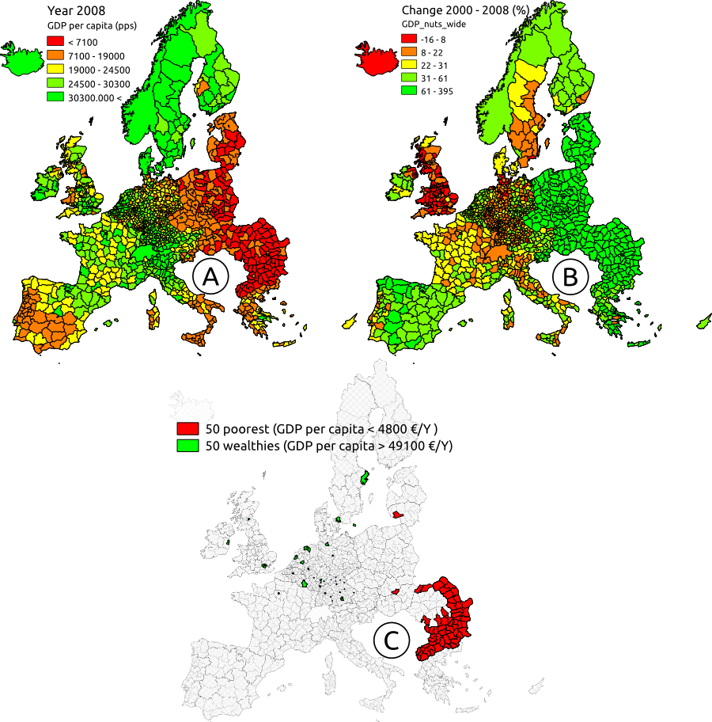
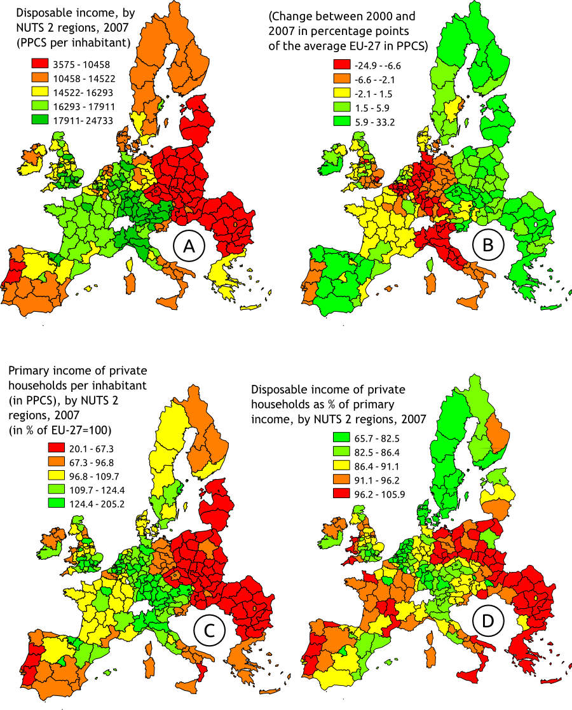
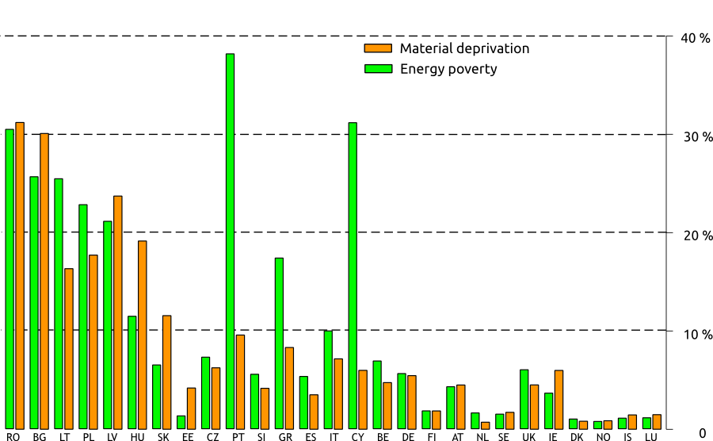
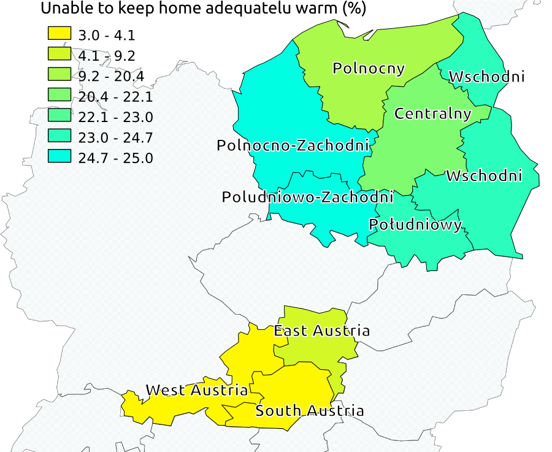
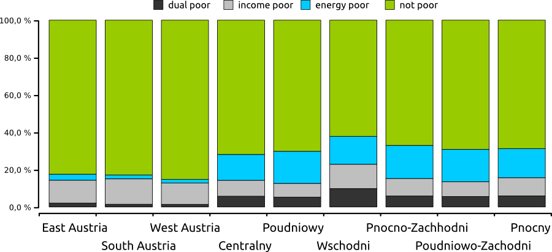
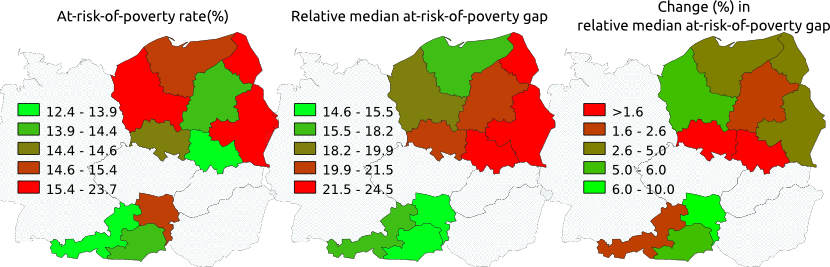

% WHO GETS WHAT - AND WHERE
% Regional poverty outcomes of social assistance in enlarged EU: The case of Poland and Austria
% Markus Kainu [^1] - summer 2011

[^1]: PhD student in Social Policy, Department of Social Research, University of Turku, Finland

<link href="http://markuskainu.fi/material/css/article.css" rel="stylesheet" type="text/css" title="compact"></link> 
<link href='http://fonts.googleapis.com/css?family=Alegreya+SC|Alegreya:400,200' rel='stylesheet' type='text/css'>

<!-- 
cd ~/workspace/eusilc/regional2013/2011
pandoc -t html espanet2011.md -o espanet2011.html --standalone --bibliography=bib/bibtex.bib --number-sections

 -->

<!-- \begin{abstract} -->
**abstract**

*Since 1989, the divide between Europe's East and West has been evident in terms of poverty and social and economical inequality. Over the transition period the between-nation inequalities have declined in the enlarged EU, while the regional inequalities have increased within most of the countries, especially within European post-socialist countries. As a result most of the economic inequalities today in enlarged EU are already inequalities within nations. An evident outcome of these increasing regional disparities is that poverty is becoming more and more rooted in place.  This seminar paper approaches poverty outcomes of social assistance from regional perspective. It addresses the question, to what extend socially targeted benefits can alleviate poverty that varies spatially. Preliminary analysis are conducted on social assistance benefits using EU2020 poverty indicators and 2008 EU-silc data from Poland and Austria.*
<!-- \end{abstract} -->

\thispagestyle{empty}

\newpage

\setcounter{page}{1}

# Introduction

Regional economic disparities in European Union have received substantial scholarly attention in recent years. Focus has been either on descriptive analysis and methodology [eg., @stewart_measuring_2002;@jesuit2008subnational;@heidenreich_patterns_2008;@beckfield2009remapping;@longford2010measures] or on links between regional disparities and economic growth. [eg.,@perugini2008income;@ezcurra_does_2009;@peters_regional_2010]. In terms of inequality studies are showing similar figures: among the countries of current European Union (EU) the between-country disparities have been falling over the last 20 years, while the regional inequalities within most of the countries have increased, especially within European post-socialist countries. As a result most of the economic inequalities today in enlarged EU are already inequalities within nations. 

Levelling of these disparities has become an important goal for EU cohesion policies as stated in Article 158 in the Treaty of European Union:

>In partiular, the Community shall aim at reducing disparities between the levels of development of the various regions and the backwardness of the least favoured regions or islands, including rural areas.} [p. 118,@EU_treaty_2006].

Currently over 60 % of EU structural Fund budget is targeted to regions lagging behind the EU average in GDP per capita [p. 2,@longford2010measures]. Impact of these regional policies on disparities have been covered in various studies in terms of convergence of per capita income[@pittau2006empirical;@quah1996regional] but only among the countries of EU15. According to [p. 2,@longford2010measures] the income disparities across regions in EU15 countries have narrowed over time, but this trend cannot be equated with reduction of disparities within regions. 

As the EU cohesion funds are targeted at the regional level on the basis of GDP per capita, can the analysis of disparities between regional averages be misleading and more attention should be paid on intra regional individual or household level variations. Nevertheless, according to [p. 541-542,@rynck2001cohesion] reduction of economic inequalities at the micro level is an implicit aim for European Comission. In addition to EU policies, there are also various national level policy instruments aiming either directly or indirectly for the same. State allocates resources directly through set of policies named *fiscal federalism} [see @oates1977political], while subsidies on certain trades may have indirect redistributive effect, eg. EU agricultural subsidies[see,@hansen2007temporal]. Main policy instrument for reducing micro level income inequalities is income redistribution systems, which is in question in this seminar paper. And more precisely, this paper addresses the question, how single welfare programme, social assistance, reduces spatially varying poverty?

## Towards a spatial approach to poverty

Analysis of poverty in social policy departs often with an study of how characteristics of individual or families are connected with higher or lower risks of poverty, and such micro level explanations are found in most account of poverty. Of contextual factors, temporal variation due to recession, changes in state policies and other fluctuations are given some attention in the literature and sometimes treated as major theoretical subjects [@gundersen2004poverty]. Spatial context in terms of territorial variation of economic production has been addressed less often, though recognized by both scholars and policy makers [@cotter2007placing]  Referring to [@tickamyer_space_2000] they claim that attention to spatial variation is especially important because of the substantial variation in economic structure and poverty policies across places, and which may widen over time [p. 164,@cotter2007placing]. 

[p. 3-5,@lobao2007advancing] elaborates the importance of scale of spatial analysis. Well-developed bodies of research on poverty and other inequalities are found mainly at two opposing scales: the city or local level and across the global system of nation-states, there in between is a *missing middle}, territorial, regional or subnational spatial scale. 

>Insofar as the sociological imagination has been drawn largely to cities and nation-states, we are left with disciplinary gaps: large swathe of places, people, and substantive topics are left out of systematic investigations because they do not fall into the usual categories by which sociologist carve up space.[p. 4,@lobao2007advancing]

Spatial scale is important because it defines the territorial domain from which processes creating inequality arises. Also, it can be seen as the arena for targeting policy and political action.

*Sociology  as a discipline began with a core interest in the relationship between space and social organisation* claims Michael [p. 86.,@irwin2007territories] and refers to early 20th century classics. He states that proliferation of Geographic Information Systems (GIS) software and release of census data and other geographically aggregated data and the development of spatial statistics has accelerated the territorially based analysis. Locating data about social conditions in place allows a wide range of (spatial) data to be linked with the analysis. Not only details on regional economy and job markets, but also about geographical conditions like distance or climate, access to services, infrastructure etc.

EU regional funding and state fiscal federalism are targeted primarily spatially, while social assistance is targeted socially. Spatial or geographical targeting is practised when the aim of intervention is defined in spatial terms as region, while social targeting when aim is defined in social terms as poverty. By nature, poverty can be seen both as social and spatial. Mechanisms creating poverty can be rooted both in socio-economical or in spatial structures of society. Various socio-economic factors as social class, age, gender, income level are often linked with variations in poverty, but less often is poverty is linked with spatial factors eg. regional economy or unemployment, access to education, health care or regional concentration of social factors(risks). 

It may be claimed that spatial analysis of socially targeted policies as social assistance has no relevance as it is *social*, not *spatial* assistance. Among social benefits, social assistance has it's specific function in protection against poverty. And that is where rationality arises: as poverty is rooted in social structures it is also rooted in place, should social programs aimed at alleviating poverty analysed both, in terms of social and spatial effectiveness. Another question is, of course, whether social targeted benefit can alleviate spatial poverty?

## Post-social transition and geographies of poverty

<!-- Spatial emphasis of poverty in this paper is closely linked with post-socialist transition and dynamics of poverty during the last twenty years. The breakdown of socialist system had a dramatic effect on poverty and inequality in all of the countries. since the collapse of the Soviet Union the number of poor people increased from 14 million to nearly 150 million by the mid-1990. In the same period the countries with very equal income distribution experienced a dramatic rose in income inequality resulting in inequality levels similar to Latin American countries. [ 67-71]{milanovic1998income} -->

As text for this chapter is not ready at the moment, there are two figures telling part of the story. Current regional economic disparities are plotted on a map in figure 1. The divide between West and East is clear (map A), as is the fact that many regions in Eastern Europe are catching up (map B). Map C portraits the regional extremes (50 poorest and wealthiest regions).

In Figure 2 illustrating the regional variations in terms if income. maps A and B show disposable income, while map C presents the relative level of primary (market) income in relation to EU27 average. Map D sheds light into the redistribution of incomes and show share of disposable income of market incomes. The further away from green the region is the less there is redistribution within that nation state.

Before the analysis some hypothesis can be drawn, though they can't be adequately tested in the current setting. Firstly, it is assumed that *spatial impact* of social assistance is low in all of the countries. In addition, as there is more absolute poverty (housing deficiencies, fuel poverty) in Eastern Europe (degradation of infrastructure) the assistance from social benefits makes little difference for spatial disparities. While poor regions are getting more run down, the net impact of income redistribution is not able slow down the process. 

# Data & Methods

My analytical framework is grounded on the recommendations of Canberra Group with two distinctive characteristics drawn from transition research. First, special emphasis is put on space and spatial dimension at the regional or "subnational" scale where much of inequality is rooted. Second, relative, income based measures of poverty are challenged with energy poverty as an indicator of more absolute deficiencies in living standards. GIS-software and cartographic illustrations [quantum_2011} are used to combine the spatial and socioeconomical aspects of analysis. Household level data from EU-SILC is used as main data frame for social indicators.

## EU-silc and Eurostat regional statistics

The data on which the analysis are based come from the EU Survey on Income and Living Conditions (EU-SILC) for 2008. EU-SILC provides comparable, cross-sectional and longitudinal multi-dimensional data on income, poverty, social exclusion and living conditions in the European Union. EU-SILC is conducted by the member states of the European Union and coordinated by Eurostat. Dataset consist of cross-sectional and longitudinal data including variables on income, poverty, social exclusion, housing and other living conditions. Data on income and social benefits are collected both at household and individual level. Household data includes aggregates for gross and disposable income and household related social benefits.

Indicators of poverty and social exclusions in EU-silc datasets was designed primarily to serve analysis at the national level. Recently, there has been growing interest on applying dataset in regional analysis both from methodological [@verma_assessment_2010,@bonerandi-richard_uses_2011] and analytical [@reinstadler_macro_2010] perspectives. Main problem arises from possible sampling errors when breaking a nationally representative sample into regional sub-samples. Is necessary to focus on most basic indicators among the Laeken indicators when breaking them down to regional level as the data breakdown itself increases the data requirements. Further narrow disaggregation of data (by age, gender, eg.) simultaneously with regional breakdown has to be applied with caution.  In addition, regional breakdown limits the possibilities to study trends over time to cross-sectional measures.[@verma_assessment_2010] 

There are various projects dealing with this issue in EU-silc as EURAREA Project (2001-2004), SAMPLE Project (2008-2011)and AMELI Project (2008-2011) and Eurostat has recently published a good overview of this issue by [see,@verma_robustness_2010] [See also,@verma_assessment_2010]. To address these issues [@kraft_simpopulation_2010] have written a package "simPopulation" for R for microsimulation procedure to improve the robustness of indicators in subgroups. Combined with package "laeken" by Andreas Alfons, Josef Holzer and Matthias Templ [see more,@templ_variance_2011,@templ_standard_2011,@templ_robust_2011] for robust analysis of social exclusion indicators in EU-silc provides solid statistical means for proceeding. 

## Unit of region

 The choice of unit of region is the first step when when pursuing a regional level analysis. In the geographical context of EU a there are numerous substantial and practical reasons for choosing the Nomenclature of Units for Territorial Statistics (NUTS) [^2]geographical-administrative regions for social policy analysis. As [p. 9.,@verma_robustness_2010] writes NUTS regions are a) most commonly used units for the formulation and implementation of social policy, b) units are well-defined and identifiable and c) already widely accepted and used by researchers and producers of statistical information.

<!-- ###################### -->
[^2]: Nomenclature of Units for Territorial Statistics (NUTS) is a geocode standard for referencing the subdivisions of countries for statistical purposes. The standard is developed and regulated by the European Union, and thus only covers the member states of the EU in detail. In EU-27 the average population size is around 5,5 milloin per NUTS1 region and 1,8 million per NUTS2 region and a little under 0,3 million per NUTS3 region. The units vary considerable in size across the countries, and often also within the countries
<!-- ###################### -->

Information about geographical location of the household is far from perfect in EU-silc, but reaches NUTS2-level for some of the countries. For this seminar paper I have chosen Austria as Western European country with low regional disparities and high income, and Poland as low-income, post-socialist country with high regional disparities. My current dataset does not allow breakdown at lover level than NUTS1, which makes analysis very superficial and suggestive at best. I'm in a urgent need for a dataset with more detailed regional classification. Level NUTS2 would already allow a breakdown into units that are relevant in regard to regional variations in, for example, regional production as well as implementation of social policies.

## Definitions of poverty

Three different concepts of poverty will be utilized in this paper, all belonging to the set of current EU2020 indicators. First measure is so called indirect and relative notion of poverty measured on national level at 60% of median income, so called *at-risk-of-poverty rate* [^3] (arpr) [@atkinson_social_2002].  In addition to arpr another laeken indicator, *relative median at-risk-of-poverty gap* [^4] is used to capture not just extend, but also the depth of poverty.

<!-- ###################### -->
[^3]: Estimate the at-risk-of-poverty rate, which is defined as the proportion of persons with equivalized disposable income below the at-risk-of-poverty threshold.

[^4]: Estimate the relative median at-risk-of-poverty gap, which is defined as the relative difference between the median equivalized disposable income of persons below the at-risk-of-poverty threshold and the at-risk-of-poverty threshold itself (expressed as a percentage of the at-risk-of-poverty threshold)
<!-- ###################### -->

The main weakness in relation to my definitions of poverty can be seen in figure 3 that illustrates the median household incomes and poverty thresholds by EU countries. It's notable that poverty threshold in Austria is more than double the median income in Poland. This means, of course, that the poor household in Poland has substantially lower level of material assets than the Austrian counterpart. A use of EU-wide poverty threshold could have been used to strengthen the analysis as recommended by [p. 115,@atkinson2005taking], but was not employed at this stage. [See more,@fahey2007case].

In addition to income based poverty measures, a measure of material deprivation will be applied. Levels of material deprivation are plotted against poverty thresholds in figure 4. After the enlargements of EU it soon became apparent that statistics on relative income positions sometimes failed to capture essential differences in living standards across the member states [@marlier_eu_2007]. The fruitfulness of non-monetary poverty indicators was recognized in the leading scholarly work related to the process of developing common benchmarks to evaluate social development in the EU countries [@atkinson_social_2002]. In 2009 the EU also decided to monitor material deprivation, complementing the income based conceptualization of poverty that were established a few years earlier.

The idea to study material deprivation is not new, but has been on the agenda in poverty research since the late 1970s at least, particularly in the Ireland, the United Kingdom and the United States [@townsend_poverty_1979,@mack1985poor,@nolan1996resources]. According to this approach the focus of analysis is not income, but rather goods and services households can consume. People unable to afford certain basic items are considered to be materially deprived.  Although the conceptualization and measurement of material deprivation are by no means straightforward, there seems to be some agreement that assessments based on consumption tend to produce more reliable figures on poverty than evaluations in terms of income. For example, respondents in low income household often tend to underreport income, something that may bias poverty estimates based on income surveys.

Although such combined strategies in the measurement of poverty may improve the validity of the findings, for example, by including only those who cannot consume for financial reasons, the results may be problematic to interpret from a policy perspective. One reason is that public programs may have different effects on income and consumption. Thus, there is an important policy dimension to poverty measurement, which has not yet been sufficiently recognized in the literature. In light of the new EU 2020 targets, where material deprivation seems to be placed on equal footing to that of relative income poverty for measuring social progress, it is crucial to move research ahead by incorporating also social policy structures to the comparative analysis of material deprivation. Whereas the income approach to poverty measurement implicitly links social stratification to equality of opportunity, the strategy to focus on consumption and material deprivation concerns more equality of outcomes [@ringen1988direct].

## Method for analysing spatial poverty effects of social assistance}

Information about social assistance is provided through a variable *social exclusion, elsewhere not classified*. It incorporates two components, namely on income support (periodic payments to people with insufficient resources) and other cash benefits (support for destitute and vulnerable persons to help alleviate poverty or assists in difficult situations). In addition, data is also available on means-tested housing allowances. The social assistance variable used in this paper is constructed by joining the two components, i.e. social exclusion not elsewhere classified and means-tested housing allowance. 

At this stage very simple methodological applications are used. As there are two concept of poverty, monetary and non-monetary, two different approaches are required. As for the analysis of income poverty a *standard method* by Wilfred [@beckerman_impact_1979] will be utilized, where poverty rates and gaps are compared before and after social assistance is taken into account. Using this method either the overall poverty effect of income redistribution system or the partial effect of certain benefit can be compared [p.18,@behrendt_at_2002]. This analysis will be conducted using both national level poverty thresholds.

In regard to both, income and energy poverty, a set of simple arithmetic calculations are applied to analyse the *targeting performance* of social assistance. First, poor households are defined in two different ways 1) income poor using national threshold  and 2) energy poor using variable HH050 in EU-silc. Second, relative shares and absolute mean values of social assistance received by poor households are calculated. Third, a measure relative share received by poor households from the total sum of social assistance received by all households is calculated. Interpretation of this measure is such that values above one (1) means that in this region poor households receives proportionally more social assistance than the non-poor households. %Figure 5 show the overlap of poor household defined by lack of income and energy.

# Analysis

Brief description of figures and graphs are provided at this stage.

Figure 6 describes the levels of poverty indicator by regions and shows the relative effect of social assistance in terms of relative median-at-risk-of-poverty gap. When comparing the poverty rates and gaps it worth of noting that especially in Poland, the regional picture of poverty changes a lot when moving from extend of poverty (rate) to severity of poverty (gap). Southern regions facing the Tatra mountains have relatively low share of poor households, but those poor household are more poor than households in Western and Northern regions. The last map points out that social assistance is not able to lower the poverty, but is most inefficient in those regions of severe poverty.

**Table: Different measures of poverty by regions before and after social assistance. Standard deviations between regional figures.**

Table 1 supports the findings from graph. In addition, by looking at the standard deviations, it can be noted that regional differences are substantially lower in Austria. Also social assistance is more effective in levelling the regional differences. In terms of poverty gap, social assistance increases the regional differences, especially in Poland. Social assistance has only minor effect on income inequality measured as gini-coefficient.

Targeting of social assistance is compared between income and materially deprived households in table 2. As expected, the share of materially deprived households is about three to four times as high in Polish regions as in Austrian regions. Interestingly, materially deprived households receive substantially higher average benefits in Austria than income poor. In Poland, the situation is different in this respect and materially deprived households tend to receive less than income poor households. Same applies to targeting as in Poland the income poor household are better covered by social assistance, whereas in Austria they are covered worst than materially deprived households.

**Table: Targeting of social assistance in regional perspective. Calculations based on EU-silc 2008. Mean benefits per year**

# Conclusion

Still pending for better research design and more robust analysis.

# Literature
